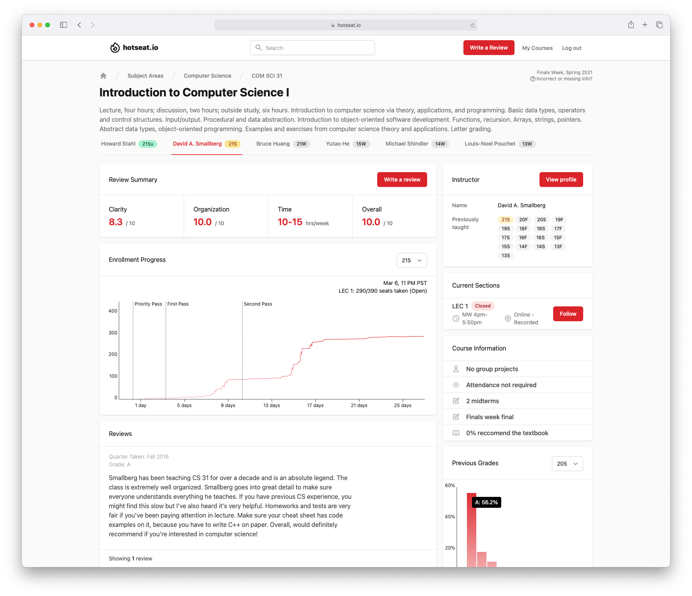

We're super excited to announce Hotseat, the best way to enroll in classes at UCLA.

## What’s Hotseat?

Hotseat is the newest course enrollment platform. We aggregate course information from multiple sources – information like grade distributions, professor evaluations, textbook information and more – and provide it to students completely free of charge. All you need is a UCLA email address and the world of better enrollment is at your fingertips.

## Who Are We?

Hi, we're [Nathan](https://nathansmith.io/) and [Timothy](https://github.com/TimothyGu), both UCLA Computer Science majors. For years, we've had trouble enrolling in the classes we want. As underclassmen, popular classes often fill up before our turn, forcing us to quickly find alternatives. In other cases, we inadvertently “wasted” our first pass on a class that isn't too popular after all. This frustration turned into a desire for more information to inform our class planning.

## How is Hotseat different from…?

Hotseat is unique in that we integrate data directly from the UCLA Registrar. Doing so gives us information such as real-time enrollment progress that you can't find anywhere else.

With historic enrollment progress, you know exactly when to expect a class to fill up, and can allocate first-pass and second-pass course enrollment slots accordingly. Along with other information such as instructor reviews, Hotseat puts _you_ in the driver seat for course enrollment.

## What's Next?

We have a lot more exciting updates coming down the pipeline. Here are a few ideas on our radar:

- Course planner
- Enrollment notifications
- Finding study groups
- Graduation progress

If there's a feature you want to see in Hotseat, let us know at [suggestions@hotseat.io](mailto:suggestions@hotseat.io)!

## Sign Up Now!

Sign up today, and don't be afraid to start reviewing your favorite (or least favorite) professors while perfecting your schedule for next quarter. Begin your journey now at [hotseat.io](https://hotseat.io/)!
