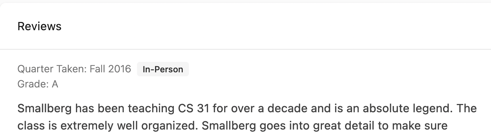

Since releasing Hotseat in June, we've been working hard at adding more features to make the enrollment process even more seamless. Introducing – Hotseat: Back to School Edition!

## Class status texts

This is the feature we've been most excited about. Get text messages when a class opens up or becomes full! The message will have a link that takes you directly to MyUCLA.

To get enrollment texts, you first need to head over to your [settings page](https://hotseat.io/settings) and add your phone number. Note that text message/data rates may apply if you opt-in to this feature.

Then all you need to do is click on the bell icon on a course's page or your my courses page. You'll get a popup asking you to confirm your subscription. Once you confirm, you'll start getting texts when the status of a class changes. You can unsubscribe anytime from your my courses page. We'll also automatically unsubscribe you from all your notifications after week 2 of the quarter, since that's when enrollment closes for classes.

Note that you can't subscribe to an unlimited number of courses! You must use a Notification Token to subscribe to a course. If your account doesn't any tokens, then you can't get text notifications on the course. However, Notification Tokens are free! For every review you write, you get one Notification Token. And every new account starts with 4 tokens so you don't have to worry about reviewing any courses right away.

## Drop graphs

One of the core Hotseat features is showing you enrollment graphs you know which classes to first pass and what to save for second pass. We've expanded this feature to the first few weeks of a new quarter! This gives a great idea of how likely you are to get off a waitlist.

## Previous versions of the same course

Courses over time change names, numbers, departments, and descriptions but often the core content and professors stay the same. However, this can be confusing on platforms like Hotseat. Is it CS 97? Or is it CS 35L? We now display banners above out of date courses that link you to the most recent version. We also allow you to peek back at previous courses in case a course has changed!

## Marking the class type in the review

Let’s face it, online classes are very different from their in-person or even hybrid counterparts. So we now display the format of the course on the review for the course!

## Filtering Courses

When viewing the courses offered for a subject, you can now switch between all courses ever offered and just the current courses offered.

## Other improvements

There's a bunch of other stuff we didn't get to! We overhauled search to make it faster and more accurate, we link directly to MyUCLA in more places for easy enrollment and extra details, we've created a moderation system to ensure accurate reviews, and we've made a ton of bug fixes to ensure Hotseat is speedy and reliable.

## Sign up

If you haven't already, [sign up for Hotseat](https://hotseat.io/) today! It's completely free.
