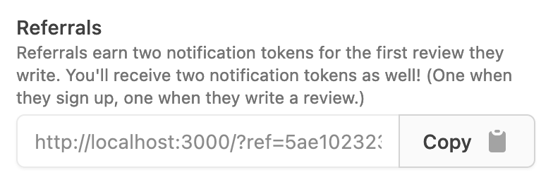

You can now refer your friends and classmates to Hotseat via a unique link on your [settings page](https://hotseat.io/settings)! If they sign up using your link and write a review, then you will both get two notification tokens!

As a bonus, we're also running a referral contest! If you refer the most new users to Hotseat by February 1, you'll get a **$50 Amazon gift card**.

The fine print:

- Hotseat Referral Promotion Contest (the "Contest") is open to legal residents of the fifty (50) United States and the District of Columbia who are at least eighteen (18) years old at the time of entry.
- The Contest is sponsored by Hotseat Labs, LLC.
- Participation in the Contest constitutes entrant's full and unconditional agreement to and acceptance of these Official Rules and the decisions of the Sponsor, which are final and binding. Winning a prize is contingent upon being compliant with these Official Rules and fulfilling all other requirements set forth herein.

- Contestants can enter by creating a Hotseat account at [https://hotseat.io](https://hotseat.io) and sharing their unique referral code to other potential Hotseat users.
- The winner will be the Hotseat user whose referral link is associated with the most new user signups.
- Only new user sign ups will be counted. Referred users must use your unique link.
- The contest begins at 8am Pacific Time on December 10, 2021 and ends at 11:59pm Pacific Time on February 1, 2022. Entries that are submitted before or after the Contest Period will be disqualified.
- The prize is one $50 Amazon gift card. In the event of a tie, we will split the value of the gift card among the winners.
- Sponsor will contact the winner via email by February 8, 2022. The potential winner will be required to complete, electronically sign and submit a Declaration of Compliance within five (5) days of the date notice or attempted notice is sent, in order to claim his/her prize. If a potential winner cannot be contacted, or fails to submit the Declaration of Compliance within the required time period (if applicable), or prize is returned as undeliverable, potential winner forfeits prize.Potential winners must continue to comply with all terms and conditions of these Official Rules, and winning is contingent upon fulfilling all requirements. If the potential winner cannot be contacted within five (5) days after the date of the first attempt to contact him/her, the Sponsor may select an alternate potential winner in his/her place from the remaining non-winning, eligible entries using the contest criteria for the winner. Prizes will be fulfilled approximately 8-10 weeks after the conclusion of the Contest.
- In the event that the operation, security, or administration of the Contest is impaired in any way for any reason, including, but not limited to fraud, virus, bug, worm, unauthorized human intervention or other technical problem, or in the event the Contest is unable to run as planned for any other reason, as determined by Sponsor in its sole discretion, the Sponsor may, in its sole discretion, either (a) suspend the Contest to address the impairment and then resume the Contest in a manner that best conforms to the spirit of these Official Rules or (b) terminate the Contest and, in the event of termination, award the prize at random from among the eligible, non-suspect entries received up to the time of the impairment. The Sponsor reserves the right in its sole discretion to disqualify any individual it finds to be tampering with the entry process or the operation of the Contest or to be acting in violation of these Official Rules or in an unsportsmanlike or disruptive manner. Any attempt by any person to damage the website or undermine the legitimate operation of the Contest may be a violation of criminal and civil law, and, should such an attempt be made, the Sponsor reserves the right to seek damages (including attorney's fees) and any other remedies from any such person to the fullest extent permitted by law. Failure by the Sponsor to enforce any provision of these Official Rules shall not constitute a waiver of that provision.

- By participating in the Contest, entrants agree to release and hold harmless the Sponsor, and each of their respective parents, subsidiaries, affiliates, advertising and promotion agencies, other companies associated with the Contest, and each of their respective officers, directors, employees, shareholders, representatives, and agents (the Released Parties) from and against any claim or cause of action arising out of participation in the Contest or receipt or use of the prize (including any travel or activity related thereto), including, but not limited to: (a) any technical errors associated with the Contest, including lost, interrupted or unavailable Internet Service Provider (ISP), network, server, wireless service provider, or other connections, availability or accessibility or miscommunications or failed computer, satellite, telephone, cellular tower or cable transmissions, lines, or technical failure or jumbled, scrambled, delayed, or misdirected transmissions or computer hardware or software malfunctions, failures or difficulties; (b) unauthorized human intervention in the Contest; (c) mechanical, network, electronic, computer, human, printing or typographical errors; (d) any other errors or problems in connection with the Contest, including, without limitation, errors that may occur in the administration of the Contest, the announcement of the winner, the cancellation or postponement of the event and/or the flyover, if applicable, or in any Contest-related materials; or (e) injury, death, losses or damages of any kind, to persons or property which may be caused, directly or indirectly, in whole or in part, from entrants participation in the Contest or acceptance, receipt or misuse of the prize (including any travel or activity related thereto). Entrant further agrees that in any cause of action, the Released Parties liability will be limited to the cost of entering and participating in the Contest, and in no event shall the entrant be entitled to receive attorney's fees. Released Parties are also not responsible for any incorrect or inaccurate information, whether caused by site users, tampering, hacking, or by any equipment or programming associated with or utilized in the Contest. Entrant waives the right to claim any damages whatsoever, including, but not limited to, punitive, consequential, direct, or indirect damages.
- Except where prohibited, each entrant agrees that any and all disputes, claims and causes of action arising out of, or connected with, the Contest or any prize awarded shall be resolved individually, without resort to any form of class action, and exclusively by the appropriate court located in California. All issues and questions concerning the construction, validity, interpretation and enforceability of these Official Rules, entrants rights and obligations, or the rights and obligations of the Sponsor in connection with the Contest, shall be governed by, and construed in accordance with, the laws of California, without giving effect to any choice of law or conflict of law rules, which would cause the application of the laws of any jurisdiction other than California.
- Information collected from entrants is subject to sponsor's [privacy policy](https://hotseat.io/privacy).
